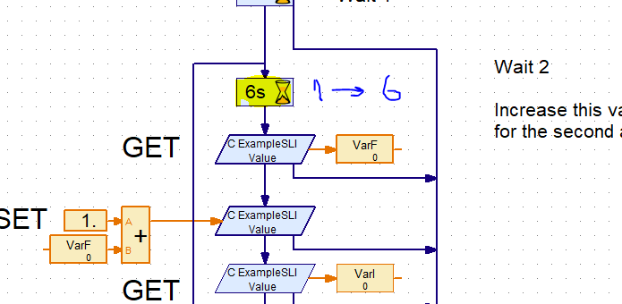

# Content
<!-- TOC depthFrom:1 depthTo:6 withLinks:1 updateOnSave:1 orderedList:0 -->

- [TXT Shared Library Interface (SLI) for ROBOPro](#txt-shared-library-interface-sli-for-robopro)
	- [Assignment 1](#assignment-1)
	- [Assignment 2](#assignment-2)
	- [Assignment 3](#assignment-3)
		- [part A](#part-a)
		- [part B](#part-b)
		- [What have you learn?](#what-have-you-learn)
- [document history <a id="history"></a>](#document-history-a-idhistorya)

<!-- /TOC --> 

[Back to workspace root](../README.md)
# TXT Shared Library Interface (SLI) for ROBOPro
Basic example shows  the principals of the SLI mechanism.

## Assignment 1 
- Compile this project
- copy the `libExampleSLI.so` from the Release map to the TXT libs map () with FileZilla or the TXT web interface.
- Start Putty with screen -r as console.
- Open with Notepad++ (NPP) the Putty log file.
- Start the RoboPro program `LibExample01(SLI).rpp`
- Try to understand wat is happening.
- Press Stop
- inspect the log file with NPP.

## Assignment 2
- Switch the TXT off and on.
- Start Putty and NPP as in Assignment 1.
- Start en stop after 2 passages of the 1 sec wait element the RoboPro program `LibExample01(SLI).rpp`.
- Repeat this for a second time.
- Look up in the log file the  two passages of the `init` function.<br/>
  This will look like something like this:
```
  SharedLibraryInterface_ExecuteWriteINT16 libExampleSLI.so init -32768
  SharedLibraryInterface_ExecuteReadINT16 lib 0xb3501620
  SharedLibraryInterface_ExecuteReadINT16 func 0xb40498f1
  ****init: xxxxxxxxxxxxxxx!
  ****init: yyyyyyyyyyyyyyy!
  SharedLibraryInterface_ExecuteWriteINT16 libExampleSLI.so init RESULT 0 -32768
```
  Try to explain the differences?
  
## Assignment 3
### part A
Change the value of `Wait 2` from 1 to 6.<br/>

 
  
What is happening in the log?<br/>
This will look like something like this:
```
M:1 1 1 1, I:11 11 11 11 11 11 11 11, c:0 0 0 0
IOs/s DL=72 OL=72, Cam DL=0 OL=0, I2C tr=0 by=0
IOs/s DL=96 OL=96, Cam DL=0 OL=0, I2C tr=0 by=0
IOs/s DL=97 OL=97, Cam DL=0 OL=0, I2C tr=0 by=0
IOs/s DL=99 OL=99, Cam DL=0 OL=0, I2C tr=0 by=0
IOs/s DL=98 OL=98, Cam DL=0 OL=0, I2C tr=0 by=0
ERROR calling read
Closing I2C server connection from 192.168.10.136
I2C Server Thread terminated
IOs/s DL=97 OL=97, Cam DL=0 OL=0, I2C tr=0 by=0
IOs/s DL=97 OL=97, Cam DL=0 OL=0, I2C tr=0 by=0
IOs/s DL=100 OL=100, Cam DL=0 OL=0, I2C tr=0 by=0
```
### part B
Run the `LibExample01(SLI).rpp` in the local mode 
Is the result the same?
  
### What have you learn?
-In the online mode there is an `ERROR calling read`, this is a RoboPro issue.<br/>
  The workaround will be presented in the following project.   

# document history <a id="history"></a>
- 2020-05-24 Cvl 466.1.1 new