[Back to main content overview](/README.me#overview)
# TXT WEB Server
## Introduction
The TXT controller firmware version> = 4.5.0 contains an integrated WEB server that can be used to upload and download programs, SLI's data and data files to/from the TXT controller. In this way, e.g.  compiled C/C++ programs are copied from the computer to the TXT controller and then started via the user interface of the TXT controller.

## How to activate the web server?
If the WEB server is not yet switched on, it must first be activated in the TXT menu (*Settings* -> *(down arrow)* -> *Security* -> *WEB Server*). When the WEB server is switched on, a "ws" symbol is displayed in the upper TXT status bar.

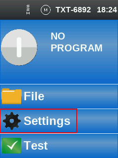 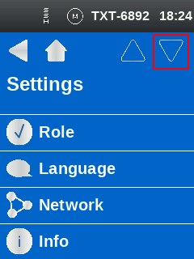 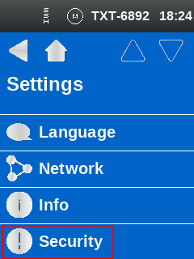  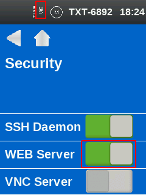
## How to connect?
The TXT controller can be connected to the computer via *USB* / *WLAN* / *Bluetooth*.

The WEB page of the TXT controller can be accessed when the IP address is entered in the WEB browser (*Chrome* or *Firefox* are recommended). Depending on the interface, a different IP address must be entered.

* **USB**: 192.168.7.2
* **WLAN AP**: 192.168.8.2
* **Bluetooth**: 192.168.9.2
* **WLAN Client**: X.X.X.X

The page of the TXT controller is password protected.

* **User**: *TXT*
* **Password**: Four-digit number of the TXT controller displayed in the upper status bar on the TXT display (e.g. *6892* if "TXT-6892" is displayed)

The following query of the password is displayed in the WEB browser:

After entering the password, the page of the TXT controller should now be visible.

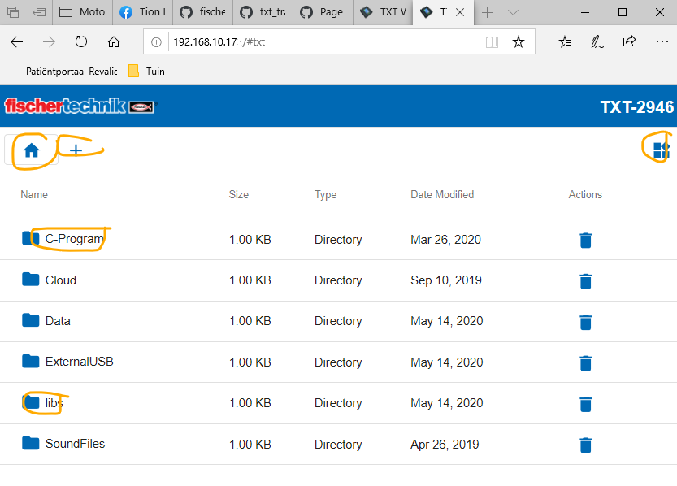
## How to managed directories and files
There exist a number of predefined directories (maps). The use can add his proper files and maps. 
It is also possible to use a USB stick or SD-card (if not in use as boot device).

- To upload (copy) **compiled C/C++ programs** to the TXT controller, change to the directory "C-Program" by clicking on it with the mouse. In this directory  are stored on the TXT controller.
- To upload (copy) **compiled C/C++ SLI libraries** to the TXT controller, change to the directory "libs" by clicking on it with the mouse. In this directory (.so) SLI shared libraries are stored on the TXT controller.   Remark: This directory is not usable for normal C/C++ share libraries.
- To upload  and/or download **data files**  to/from the TXT controller, change to the directory "Data" by clicking on it with the mouse. In this directory could be data files stored on the TXT controller.  Data files which are used or created by the SLI's and C/C++ programs. 
### Symbols
#### Create a new map or uploading file(s) to the TXT.
   If you click on **+**, a dialog box opens in which you can select files on the computer with "Upload files" and add them with "Add Files". If one or more files have been selected, they are uploaded to the TXT Controller with "Finish".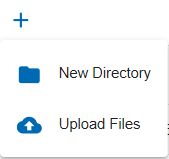
####  Delete directory or file
 Files can be deleted using the **Recycle Bin** icon behind the file name   icon. Directories can be delete using the **Recycle Bin** icon behind the directory name.
#### downloading files from the TXT 
  Files can be deleted using the **Recycle Bin** icon   icon behind the name.
 
  
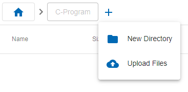 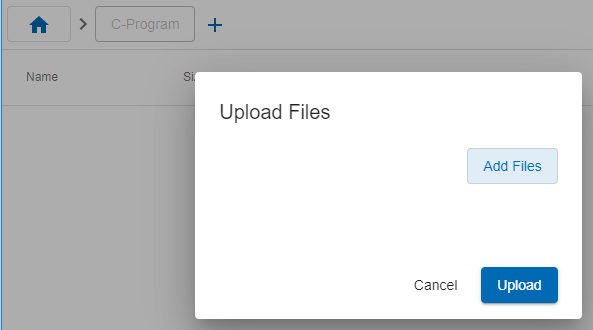 

## loading and starting a compiled C/C++ Program 

A compiled C/C++ program is automatically loaded at power up when "Auto Load" is enabled. The program is loaded with "Load" as usual with the TXT controller and can then be started via the green button. 
In the screenshot is the compiled C/C++ program `TxtFactoryVGR` (an executable has no extension) used.

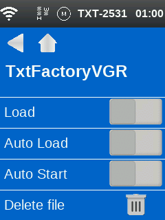
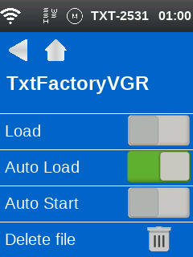
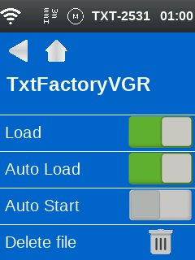

If the program is started, the button will change to red. The program can be stopped again with the red button.

 
## How to make use of a USB storage device or a SD-card?
On the web page with the root you could see this:

On the web page under ExternalUSB and ExternalSD you could see the device names of already used devices. 
These maps kan not be deleted. The device that is realy present can also be inspected.

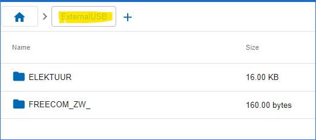

You could see something like this:

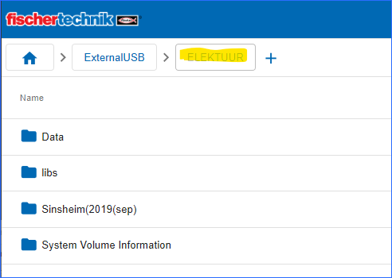

# document history 
- 2020-05-24 CvL 466.1.1 new
-  [Based on fischertechnik Training Factory](https://github.com/fischertechnik/txt_training_factory/blob/master/doc/WEBServer.md) 
  