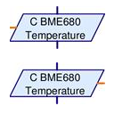

# TXT Shared Library Interface (SLI) for ROBOPro

The shared library input/output element allows to call functions and return/supply a value from/to shared library modules installed on the TXT controller. Such libraries are typically written in the C or C++ programming language. This allows interfacing ROBOPro with C / C++ programs, which is useful for accessing advanced sensors or for compute intensive tasks like image processing.



> You need TXT firmware version >=4.4.3

> see ROBOPro help in section 8.2.9 and 8.2.10

## Shared Library / C Input
Each input element allows to return only one numeric value. If parameters are required, the shared library output element can be used to first set parameters in the library. If multiple parameters or multiple return values are required, multiple input and/or output elements can be used. This means that it is typically required to write a small wrapper layer to interface ROBOPro to existing shared libraries. fischertechnik provides a library for the BME680 environmental sensor as example.

The input element can either retrieve a 16 bit signed short or a 64 bit double value from the shared library. Example C decalartions for such functions are:
```c
int getValueDouble(double* t);
int getValueShort(short* t);
```

## Shared Library / C Output
For outputs the C functions should be declared like:
```c
int setValueDouble(double v);
int setValueShort(short v);
```

## Shared Library in C / C++
The next section shows an example interface written in C / C++.

### libExampleSLI.so
```c
#include <stdio.h>

#include "KeLibTxtDl.h"          // TXT Lib
#include "FtShmem.h"             // TXT Transfer Area

static bool IsInit = false;

static double value_d;
static INT16 value_s;

extern "C" {

// Return value:
//  0: success, continue with waiting for pFinishVar becoming 1
//  1: not finished
//  2: busy (entity locked by other process)
// -1: error
// Other positive values can be used for other waiting codes
// Other negative values can be used for other error codes

int init(short* t)
{
    if(!IsInit)
    {
        // Do whatever inititialization is required
        value_d = 0.0;
        value_s = 0;
        IsInit = true;
    }
    return 0;
}

int setValueDouble(double v)
{
    if( !IsInit )
    {
        fprintf(stderr, "ExampleSLI:setValueDouble: Not initialized!\n");
        return -1;
    }
    value_d = v;
    printf( "ExampleSLI:setValueDouble: %lg\n", v);
    return 0;
}

int setValueShort(INT16 v)
{
    if( !IsInit )
    {
        fprintf(stderr, "ExampleSLI:setValueShort: Not initialized!\n");
        return -1;
    }
    value_s = v;
    printf( "ExampleSLI:setValueShort: %d\n", v);
    return 0;
}

int getValueDouble(double* v)
{
    if( !IsInit )
    {
        fprintf(stderr, "ExampleSLI:getValueDouble: Not initialized!\n");
        return -1;
    }
    *v = value_d;
    printf( "ExampleSLI:getValueDouble: %lg\n", *v);
    return 0;
}

int getValueShort(INT16* v)
{
    if( !IsInit )
    {
        fprintf(stderr, "ExampleSLI:getValueShort: Not initialized!\n");
        return -1;
    }
    *v = value_s;
    printf( "ExampleSLI:getValueShort: %d\n", *v);
    return 0;
}

} // extern "C"
```

## ROBOPro
The function names should start with get and end with Short or Double to indicate the type, but arbitrary names can be used as well. A return value of 0 is interpreted as success, all other return values as error.

> **Please note:** the functions must be declared as extern “C” in C++ code, because at the link level C++ functions have complicated mengled names, which encode the data type of the function. C functions have their usual name at the link level.
 


### Property Window
- Under Library name you can enter the name of the shared library file. The library file must be copied to the TXT controller into the ```/opt/knobloch/libs``` or ```/usr/libs``` folder. If Extend library name is checked, the name is prepended with lib and the extension .so is appended.

- Under Function name the C name of the function to be called is entered. If Extend Function Name is checked, the name is prepended with get and the selected data type, either Short or Double, is appended.

- If Error output is checked, the element gets an additional flow output, which is used when the called C function returns an error (that is 1).

- If Lock Interface is checked, the shared library IO is locked to the current ROBOPro thread. This allows safe combination of several shared library input and output elements without interruptions from other threads. The last element in a sequence must have this unchecked. Otherwise no other ROBOPro thread can use the shared library interface.

- The Data type of the value returned can be either a 16 bit signed integer or a floating point value. If the data type is floating point, the value is converted from C 64 bit double format to ROBOPro 48 bit float format. Please note that the range and precision of these types is different and conversion errors may occur, especially for out of range values. Please also note that for 16 bit integers values a value of -32768 is treated as undefined/error in ROBOPro and is usually displayed as '?'.
